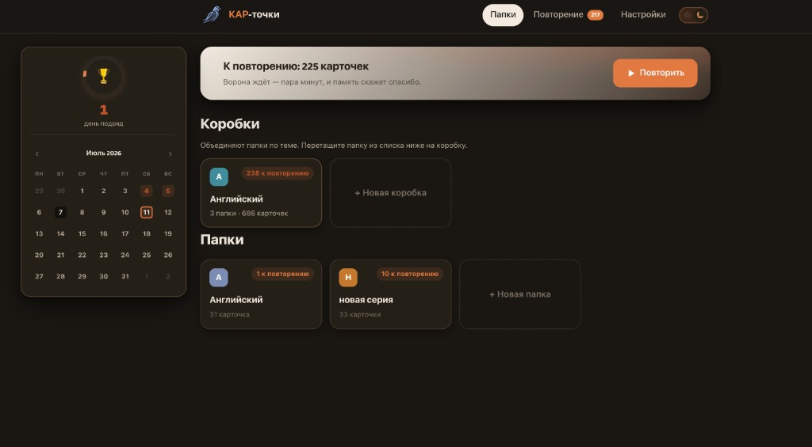
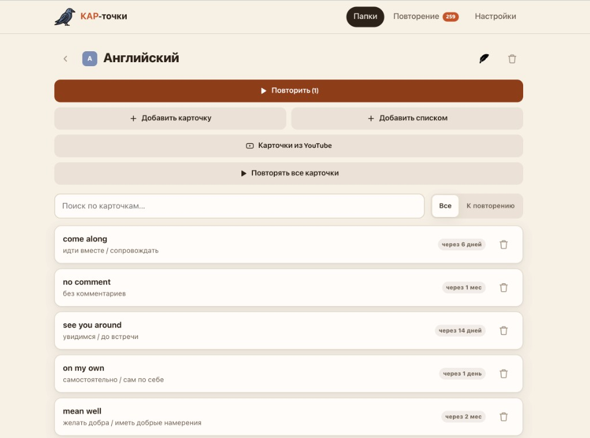
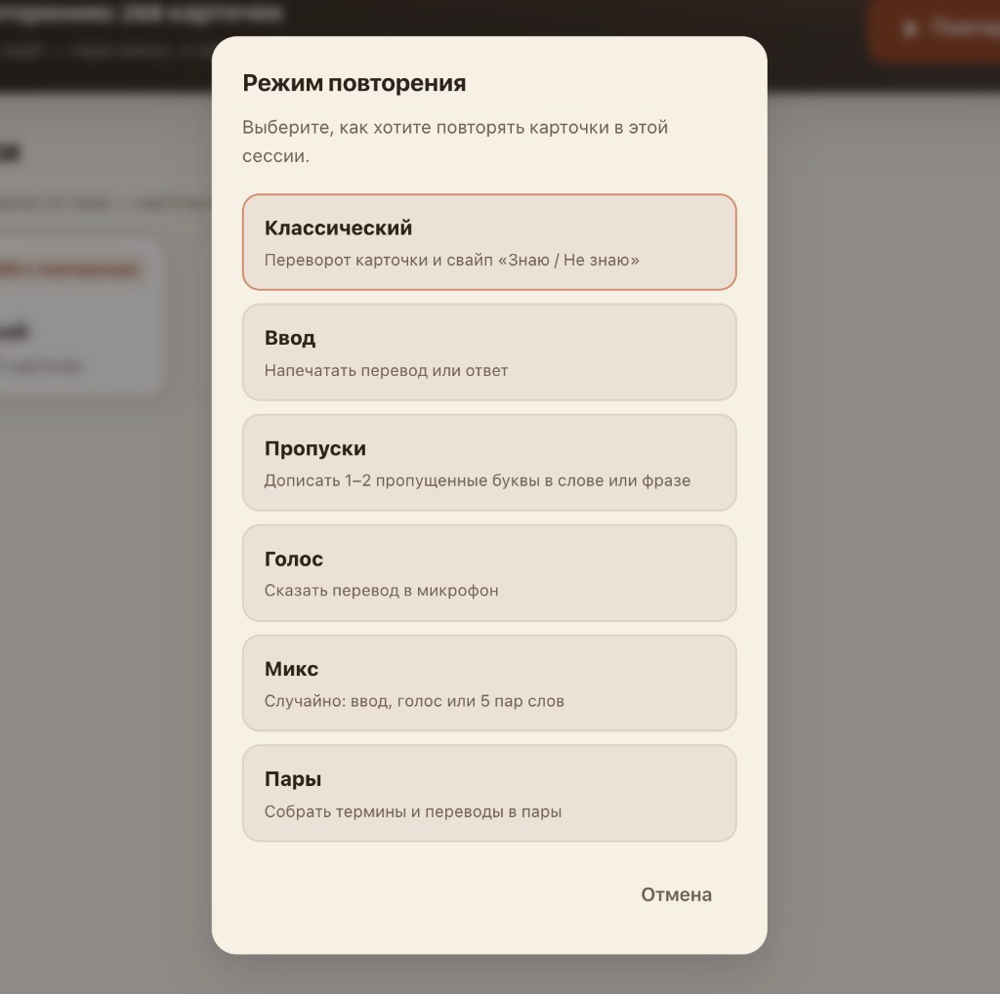
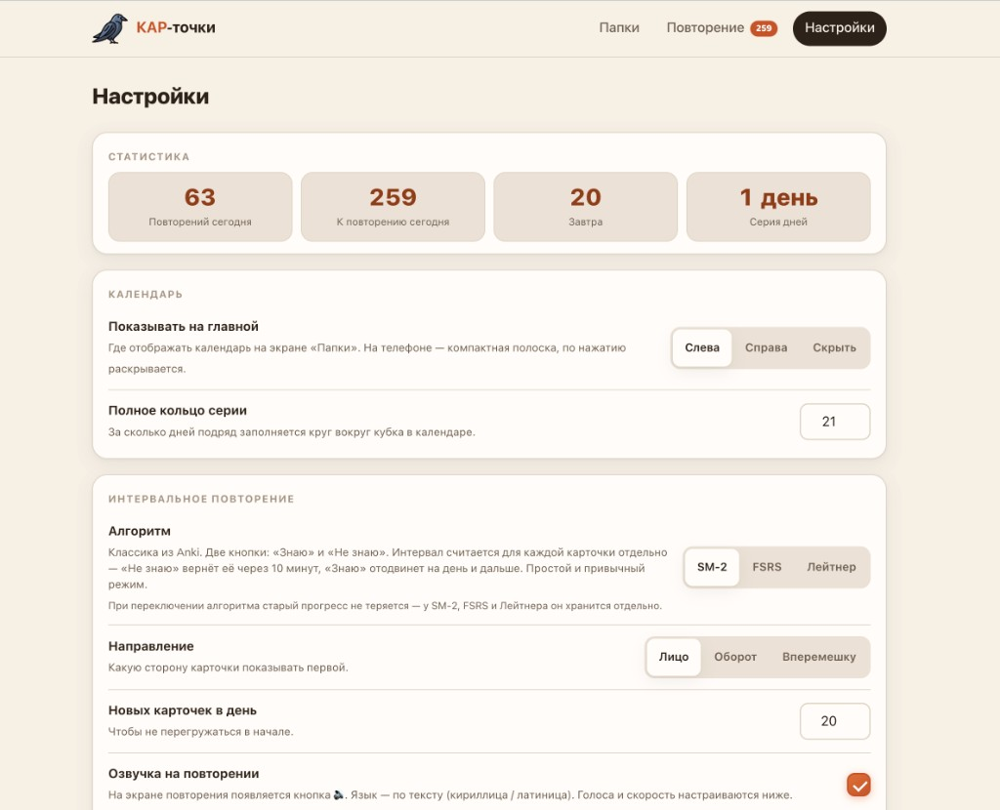

# КАР-точки 🐦‍⬛

[](https://github.com/PaperPit/kar-dots/actions/workflows/ci.yml)
[](LICENSE)
[](https://web.dev/progressive-web-apps/)

**Open-source PWA для личного использования** — разверните для себя и поделитесь ссылкой с друзьями.  
Vanilla JS, без bundler. Ваш инстанс, ваши данные, ваш Supabase (если нужен sync).

> **КАР**-точки = ворона + карточки. Не сервис с подпиской, а **репозиторий, который вы хостите сами** — как личная Anki в браузере.

**[▶ Демо автора](https://kar-dots-62.vercel.app)** · **[📖 Полная инструкция](docs/USER-GUIDE.md)** · [Roadmap](ROADMAP.md) · [Участие](CONTRIBUTING.md) · [English](#english)

---

## Для кого этот проект

КАР-точки — **self-hosted open source** для тех, кто хочет:

- учить слова и термины **без чужого облака** и без установки десктоп-приложения;
- **развернуть за вечер** на Netlify, Vercel, GitHub Pages или своём VPS;
- **дать ссылку друзьям** — каждый регистрируется на *вашем* инстансе и получает **отдельную** коллекцию карточек;
- при желании **форкнуть** и допилить под свой сценарий (MIT).

Это **не коммерческий SaaS**. Публичная ссылка [kar-dots-62.vercel.app](https://kar-dots-62.vercel.app) — демо maintainer'а, чтобы посмотреть UI. Для постоянного использования рекомендуем **свой деплой** и свой проект Supabase.

**Ищем идеи по развитию** — если форкаете или разворачиваете, расскажите, чего не хватает: [feature request](.github/ISSUE_TEMPLATE/feature_request.yml) или [ROADMAP.md](ROADMAP.md).

---

## Разверните для себя

> **Подробная пошаговая инструкция** (Netlify, GitHub Pages, компьютер, телефон, Supabase, друзья):  
> **[docs/USER-GUIDE.md](docs/USER-GUIDE.md)**

Три уровня — кратко:

| Сценарий | Что нужно | Sync между устройствами |
|----------|-----------|-------------------------|
| **Только я, локально** | Скачать репо → открыть `index.html` или `npm run dev` | Нет (данные в браузере) |
| **Я + телефон, без сервера БД** | Деплой статики + PWA, режим «без регистрации» + экспорт JSON | Вручную через бэкап |
| **Я + друзья, с аккаунтами** | Деплой статики + **ваш** [Supabase](docs/DEPLOY.md#supabase) | Да, у каждого свой аккаунт |

### Минимальный деплой (~5 минут)

1. **Fork** репозитория или `git clone`
2. Залить папку на [Netlify Drop](https://app.netlify.com/drop) или включить GitHub Pages — **[пошагово →](docs/USER-GUIDE.md)**
3. Раздать друзьям ссылку вида `https://ваше-имя.netlify.app`
4. *(Опционально)* Подключить Supabase → каждый создаёт аккаунт на **вашем** инстансе

```bash
git clone https://github.com/PaperPit/kar-dots.git
cd kar-dots
# статика готова к деплою; для разработки:
npm install && npm run dev   # http://localhost:8080
```

**Важно:** API-ключи YouTube/Gemini/Groq — **ваши**, в настройках приложения или env на хостинге. Maintainer не предоставляет общий бэкенд для чужих инстансов.

---

## Скриншоты

| Главная — коробки, drag-and-drop, тёмная тема | Папка и карточки | Режимы повторения | Настройки SRS |
|:---:|:---:|:---:|:---:|
|  |  |  |  |

---

## Теги и поиск

На GitHub репозиторий помечен **topics** — по ним вас находят в [Explore](https://github.com/topics) и через поиск.

**Topics на репозитории (20/20):**  
`flashcards` · `spaced-repetition` · `fsrs` · `sm-2` · `leitner-system` · `pwa` · `vanilla-js` · `self-hosted` · `language-learning` · `vocabulary` · `education` · `memorization` · `active-recall` · `cloze-deletion` · `youtube` · `offline-first` · `indexeddb` · `supabase` · `open-source` · `anki-alternative`

**По каким запросам нас могут найти (RU / EN):**

| Запрос | Почему подходит |
|--------|-----------------|
| карточки для запоминания, флешкарты | PWA для слов и терминов |
| интервальное повторение, SRS | SM-2, FSRS, Лейтнер |
| альтернатива Anki / Quizlet | веб, без установки, open source |
| изучение английского, vocabulary app | паки, перевод, TTS, YouTube-импорт |
| cloze / пропуски в словах | режим «Пропуски» |
| карточки из YouTube | импорт по субтитрам + LLM |
| PWA офлайн | service worker, локальный режим |
| self-hosted flashcards, deploy your own | форк + Netlify / Pages за минуты |
| личные карточки для друзей, не SaaS | свой инстанс + опционально Supabase |

Если знаете ещё подходящий topic — [напишите в Issue](.github/ISSUE_TEMPLATE/feature_request.yml).

---

## Возможности

### Карточки и контент
- Лицо / оборот с **определением** и **описанием**, rich-text (жирный, ссылка, подсветка)
- Картинки на любой стороне, drag-and-drop; **поиск стоковых фото и GIF** (Openverse, Pixabay, Giphy)
- **Просмотр карточки** перед сохранением (flip-превью в редакторе)
- Папки с цветами и иконками, **коробки** для групп папок; **перетаскивание папок мышью** в коробку и обратно
- Массовый импорт (`слово — перевод`), автоперевод RU↔EN, экспорт/импорт JSON
- **Карточки из YouTube** — субтитры + LLM (Gemini / Groq), см. [docs/youtube-import-setup.md](docs/youtube-import-setup.md)
- Готовые **паки слов** в `packs/`

### Повторение (SRS)
- Алгоритмы: **SM-2**, **FSRS**, **коробки Лейтнера** (прогресс каждого хранится отдельно)
- Режимы: классика, **ввод ответа**, **пропуски (cloze)** с inline-полями, голос, **пары**, микс
- Лимит новых в день, направление лицо↔оборот, календарь активности
- Озвучка через **Web Speech API**, выбор голосов RU/EN

### Платформа
- **Self-hosted**: статика на любом HTTPS-хостинге — ваш URL для себя и друзей
- **PWA**: офлайн-кэш, установка на iOS/Android
- **Локальный режим** (IndexedDB) — без регистрации, данные только в браузере
- **Облако** (ваш Supabase): аккаунты, sync, изоляция данных по пользователю; картинки в Storage
- **Светлая и тёмная тема** — переключатель в шапке, сохраняется в браузере
- Клавиатура и свайпы на review; увеличенная карточка на десктопе

---

## Быстрый старт

| Цель | Действие |
|------|----------|
| **Развернуть и пользоваться** | **[docs/USER-GUIDE.md](docs/USER-GUIDE.md)** — главная инструкция |
| Посмотреть UI | [Демо maintainer'а](https://kar-dots-62.vercel.app) |
| Админ: Functions, миграции | [docs/DEPLOY.md](docs/DEPLOY.md) |
| Править код | `npm install` → `npm run dev` → [CLAUDE.md](CLAUDE.md) |

```bash
git clone https://github.com/PaperPit/kar-dots.git
cd kar-dots
npm install
npm run dev    # http://localhost:8080
npm test       # Vitest
```

---

## Деплой и облако

| Задача | Документ |
|--------|----------|
| **Пошагово: деплой, ПК, телефон, друзья** | **[USER-GUIDE.md](./USER-GUIDE.md)** |
| Netlify Functions, миграции SQL | [DEPLOY.md](./DEPLOY.md) |
| Supabase (технические детали) | [DEPLOY.md#supabase](./DEPLOY.md#supabase-ваш-инстанс-для-себя-и-друзей) |
| YouTube-импорт (API-ключи) | [youtube-import-setup.md](./youtube-import-setup.md) |
| iOS / Xcode (нативная оболочка) | [IOS.md](./IOS.md) |

---

## Стек

| Слой | Технологии |
|------|------------|
| UI | HTML, CSS, vanilla JS (ES modules) |
| Анимации | [Motion](https://motion.dev/) (vendor bundle) |
| Локальные данные | IndexedDB |
| Облако | [Supabase](https://supabase.com) (Auth, Postgres, Storage) |
| SRS | SM-2, FSRS (`ts-fsrs` в тестах), Leitner |
| Serverless | Netlify Functions (`netlify/functions/`) для YouTube/LLM |
| Тесты | Vitest + happy-dom |

Без React/Vue и без production bundler — то, что в репозитории, то и отдаётся браузеру (кроме dev-скриптов и vendor motion).

---

## Структура

```
index.html              — точка входа PWA
js/app.js               — bootstrap
js/core/                — router, state
js/data/                — LocalStore, CloudStore, sync-queue
js/lib/                 — SRS, import, translate, TTS, …
js/ui/                  — shell, компоненты
js/screens/             — auth, home, review, settings, …
css/                    — глобальные и экранные стили
sw.js                   — service worker (precache)
supabase/migrations/    — пошаговая схема БД
netlify/functions/      — YouTube + LLM прокси
tests/                  — unit-тесты
```

---

## Участие в проекте

- **Идеи и голосование** → [ROADMAP.md](ROADMAP.md) + Issues
- **Баг или фича** → шаблоны в [`.github/ISSUE_TEMPLATE/`](.github/ISSUE_TEMPLATE/)
- **Код** → [CONTRIBUTING.md](CONTRIBUTING.md)

Метки, которые ищем: `good first issue`, `help wanted`, `enhancement`.

---

## English

**KAR-dots** is a **self-hosted, open-source** flashcard PWA for personal use. Deploy it on Netlify, Vercel, or your own server — share the link with friends; each person gets a private collection (optional Supabase auth). Not a commercial SaaS: you own the instance and the data.

Features: SM-2, FSRS, Leitner; typing, cloze, voice, matching; YouTube import; stock images; drag-and-drop folders into boxes; light/dark theme; offline PWA. Vanilla JS, MIT license.

See [docs/DEPLOY.md](docs/DEPLOY.md) to deploy. Ideas welcome: [CONTRIBUTING.md](CONTRIBUTING.md), [ROADMAP.md](ROADMAP.md).

---

## Лицензия

[MIT](LICENSE) — разворачивайте для себя, форкайте, делитесь с друзьями, предлагайте улучшения в upstream.

---

<p align="center">
  ⭐ Star на GitHub помогает другим найти self-hosted альтернативу для карточек.<br>
  Развернули свой инстанс? Расскажите в Issues — интересно, как вы используете.
</p>
