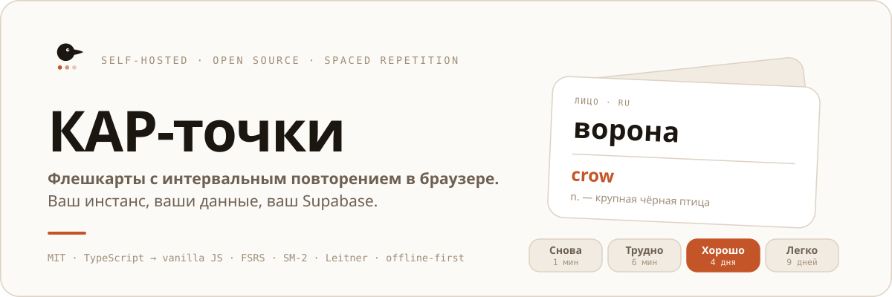
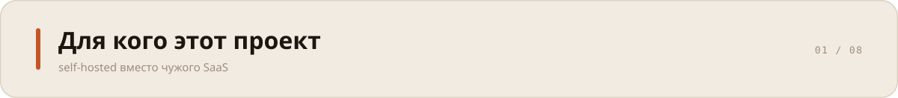
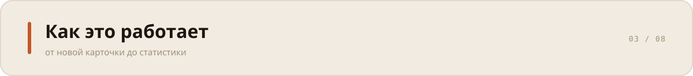
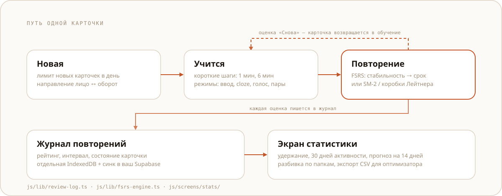
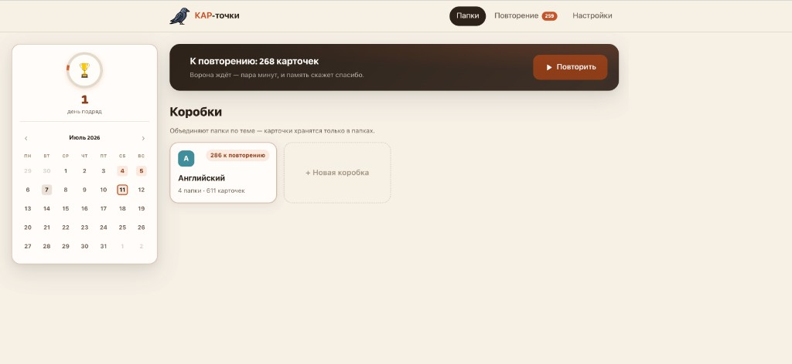
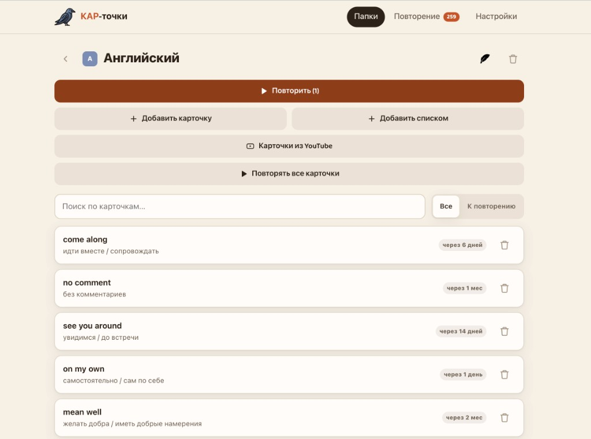
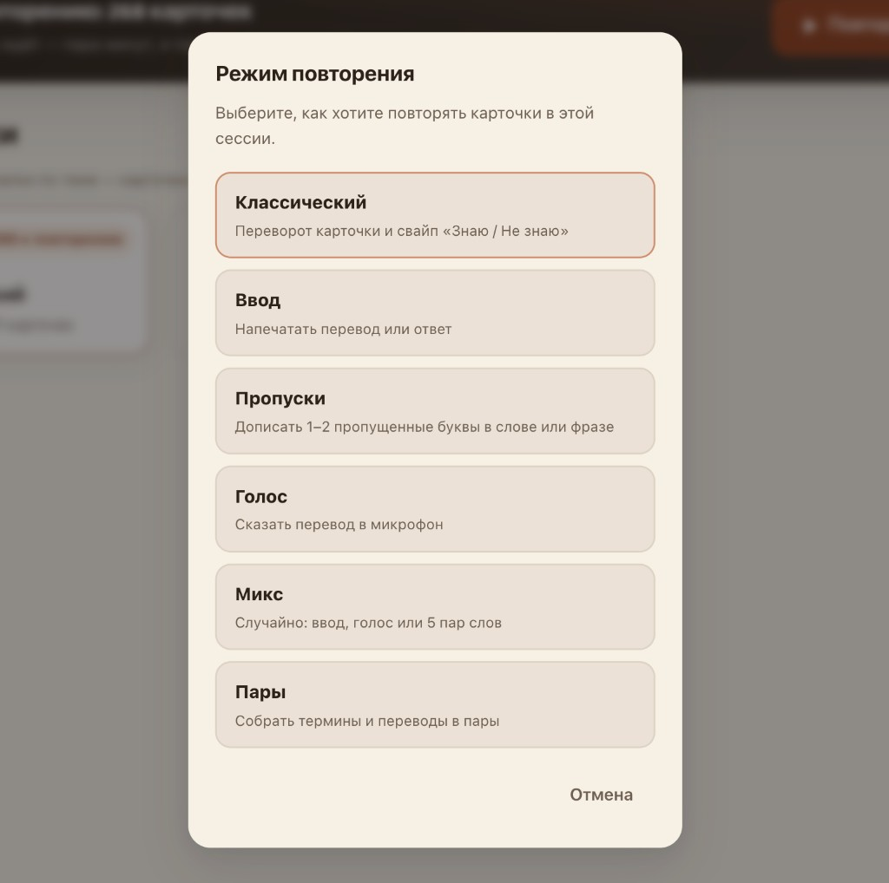
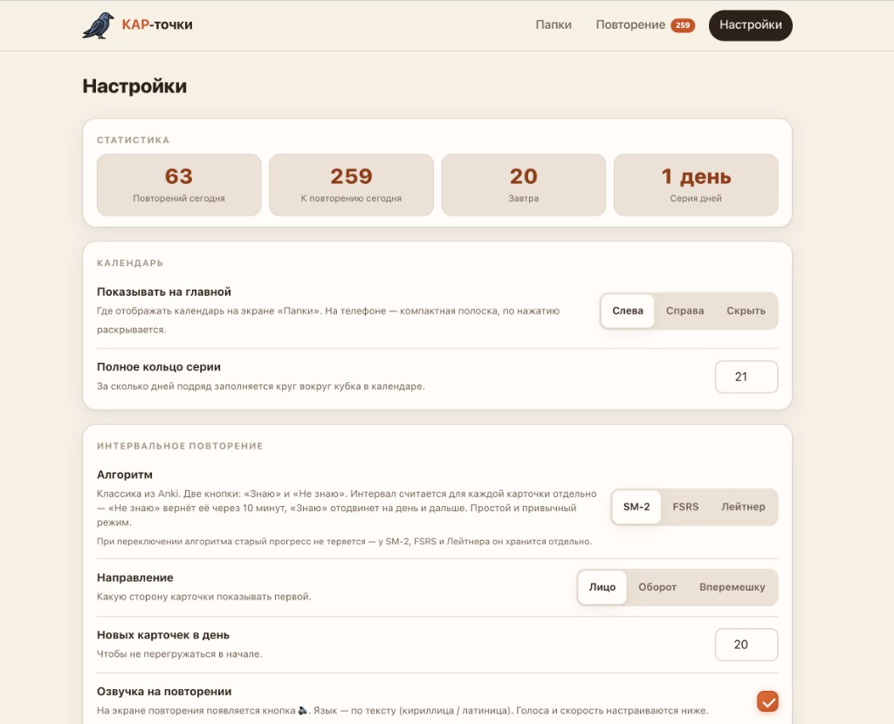
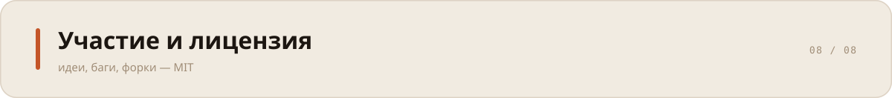

<p align="center">
  <picture>
    <source media="(prefers-color-scheme: dark)" srcset="docs/assets/readme/hero-dark.svg">
    
  </picture>
</p>

<p align="center">
  <a href="https://github.com/PaperPit/kar-dots/actions/workflows/ci.yml"></a>
  <a href="https://github.com/PaperPit/kar-dots/actions/workflows/deploy-cloudflare-pages.yml"></a>
  <a href="LICENSE"></a>
  
  
  <a href="https://github.com/PaperPit/kar-dots/stargazers"></a>
</p>

<p align="center">
  <b><a href="https://kar-tochki.pages.dev">Живое демо</a></b> ·
  <a href="docs/USER-GUIDE.md"><b>Полная инструкция</b></a> ·
  <a href="docs/cloudflare-pages-setup.md">Деплой за вечер</a> ·
  <a href="ROADMAP.md">Roadmap</a> ·
  <a href="CONTRIBUTING.md">Участие</a> ·
  <a href="#english">English</a>
</p>

> **КАР**-точки = ворона + карточки. Не сервис с подпиской, а **репозиторий, который вы хостите сами** — как личная Anki в браузере.

Разворачиваете свой инстанс на Cloudflare Pages, раздаёте ссылку друзьям — у каждого своя приватная коллекция. Внутри: **FSRS**, **SM-2** и коробки Лейтнера, шесть режимов повторения, импорт карточек из YouTube, журнал повторений со статистикой и офлайн-PWA. TypeScript → vanilla JS: без фреймворка и без бандлера в разработке.

<br>

<picture>
  <source media="(prefers-color-scheme: dark)" srcset="docs/assets/readme/s-about-dark.svg">
  
</picture>

КАР-точки — **self-hosted open source** для тех, кто хочет:

- учить слова и термины **без чужого SaaS** и без установки десктоп-приложения;
- **развернуть на Cloudflare Pages** (рекомендуется) или другом HTTPS-хостинге;
- **дать ссылку друзьям** — каждый регистрируется на *вашем* инстансе и получает **отдельную** коллекцию;
- при желании **форкнуть** и допилить под свой сценарий (MIT).

Это **не коммерческий SaaS**. Рекомендуем свой деплой на [Cloudflare Pages](docs/cloudflare-pages-setup.md) и свой проект Supabase — тогда данные и инстанс полностью ваши.

| Сценарий | Что нужно | Sync между устройствами |
|----------|-----------|-------------------------|
| **Только я, локально** | `npm install && npm run dev` | Нет (данные в браузере) |
| **Я + телефон, без сервера БД** | Cloudflare Pages + PWA, режим «без регистрации» + экспорт JSON | Вручную через бэкап |
| **Я + друзья, с аккаунтами** | Cloudflare Pages + **ваш** [Supabase](docs/DEPLOY.md#supabase-ваш-инстанс-для-себя-и-друзей) | Да, у каждого свой аккаунт |

**Ищем идеи по развитию** — если форкаете или разворачиваете, расскажите, чего не хватает: [feature request](.github/ISSUE_TEMPLATE/feature_request.yml) или [ROADMAP.md](ROADMAP.md).

<br>

<picture>
  <source media="(prefers-color-scheme: dark)" srcset="docs/assets/readme/s-features-dark.svg">
  
</picture>

### Карточки и контент

- Лицо / оборот с **определением** и **описанием**, rich-text (жирный, ссылка, подсветка)
- Картинки на любой стороне, drag-and-drop; **поиск стоковых фото и GIF** (Openverse, Pixabay, Giphy)
- **Просмотр карточки** перед сохранением (flip-превью в редакторе)
- Папки с цветами и иконками, **коробки** для групп папок; **перетаскивание папок** в коробку и обратно
- Массовый импорт (`слово — перевод`), автоперевод RU↔EN, экспорт/импорт JSON
- **Карточки из YouTube** — субтитры + LLM (Gemini / Groq), см. [docs/youtube-import-setup.md](docs/youtube-import-setup.md)
- **Chrome-расширение** — кнопка на YouTube → popup-окно без копирования ссылки, см. [docs/chrome-extension.md](docs/chrome-extension.md)
- Готовые **паки слов** в [`packs/`](packs/)

### Повторение (SRS)

- Алгоритмы: **SM-2**, **FSRS** (желаемое удержание + *fuzz*), **коробки Лейтнера**
- Режимы: классика, **ввод ответа**, **пропуски (cloze)**, голос, **пары**, микс
- Лимит **новых** и **повторений** в день, направление лицо↔оборот, календарь активности
- **Журнал повторений** и экран **статистики**: удержание, повторения за 30 дней, прогноз нагрузки, разбивка по папкам
- Озвучка: **Web Speech API** и опционально **Orpheus TTS** (Groq)

### Платформа

- **Self-hosted** на Cloudflare Pages (статика `dist/` + Functions `/api/*`)
- **PWA**: офлайн-кэш, установка на iOS/Android
- **Локальный режим** (IndexedDB) и **облако** (ваш Supabase)
- Светлая / тёмная тема; клавиатура и свайпы на review

<br>

<picture>
  <source media="(prefers-color-scheme: dark)" srcset="docs/assets/readme/s-flow-dark.svg">
  
</picture>

<picture>
  <source media="(prefers-color-scheme: dark)" srcset="docs/assets/readme/flow-dark.svg">
  
</picture>

Каждая оценка пишется в **журнал повторений** (отдельная IndexedDB, при облачном режиме — синхронизация в ваш Supabase). Из журнала строится экран статистики: фактическое удержание, активность за 30 дней, прогноз нагрузки на 14 дней вперёд и разбивка по папкам. Журнал можно выгрузить в CSV для оптимизатора весов FSRS.

<br>

<picture>
  <source media="(prefers-color-scheme: dark)" srcset="docs/assets/readme/s-quickstart-dark.svg">
  
</picture>

```bash
git clone https://github.com/PaperPit/kar-dots.git
cd kar-dots
npm install
npm run dev          # http://localhost:8080 — dev-сервер + API
npm run pages:dev    # эмуляция прод-сборки Cloudflare
npm test             # Vitest
```

**Минимальный деплой:** форк или клон → [деплой на Cloudflare Pages](docs/cloudflare-pages-setup.md) (GitHub Action уже в репозитории) → раздать ссылку вида `https://ваше-имя.pages.dev` → *(опционально)* подключить Supabase, чтобы у каждого был свой аккаунт.

| Цель | Куда идти |
|------|-----------|
| **Развернуть и пользоваться** | **[docs/USER-GUIDE.md](docs/USER-GUIDE.md)** |
| Посмотреть UI локально | `npm install` → `npm run dev` → http://localhost:8080 |
| Деплой Cloudflare | [docs/cloudflare-pages-setup.md](docs/cloudflare-pages-setup.md) |
| Админ: Functions, миграции | [docs/DEPLOY.md](docs/DEPLOY.md) |
| Править код | [CLAUDE.md](CLAUDE.md) |

> **Важно:** API-ключи YouTube / Gemini / Groq — **ваши**, в настройках приложения или в env на хостинге. Maintainer не предоставляет общий бэкенд для чужих инстансов.

<br>

<picture>
  <source media="(prefers-color-scheme: dark)" srcset="docs/assets/readme/s-shots-dark.svg">
  
</picture>

| Главная — коробки, drag-and-drop | Папка и карточки | Режимы повторения | Настройки SRS |
|:---:|:---:|:---:|:---:|
|  |  |  |  |

<br>

<picture>
  <source media="(prefers-color-scheme: dark)" srcset="docs/assets/readme/s-stack-dark.svg">
  
</picture>

| Слой | Технологии |
|------|------------|
| UI | HTML, CSS, TypeScript → vanilla JS (ES modules) |
| Dev | `tsc` на место, **без bundler** (`npm run dev`) |
| Prod | `npm run build:bundle` (esbuild → `dist/`) |
| Анимации | [Motion](https://motion.dev/) (vendor bundle) |
| Локальные данные | IndexedDB |
| Облако | [Supabase](https://supabase.com) (Auth, Postgres, Storage) |
| SRS | SM-2, FSRS (`ts-fsrs`), Leitner |
| Serverless | **Cloudflare Pages Functions** (`functions/api/`) + Workers KV |
| Деплой | Cloudflare Pages + GitHub Action на `main` |
| Тесты | Vitest + happy-dom |

```
index.html              — точка входа PWA (dev)
js/**/*.ts              — исходники (компилируются в js/**/*.js)
js/screens/             — экраны (home, review, settings, stats, …)
functions/api/          — Cloudflare Pages Functions (YouTube, LLM, TTS, stock)
wrangler.toml           — Pages + KV YT_JOBS
dist/                   — прод-сборка (esbuild)
supabase/migrations/    — схема БД
.github/workflows/      — CI + deploy на Cloudflare Pages
netlify/functions/      — legacy (запасной путь, не основной)
tests/                  — unit-тесты
```

<br>

<picture>
  <source media="(prefers-color-scheme: dark)" srcset="docs/assets/readme/s-deploy-dark.svg">
  
</picture>

| Задача | Документ |
|--------|----------|
| **Пошагово: деплой, ПК, телефон, друзья** | **[docs/USER-GUIDE.md](docs/USER-GUIDE.md)** |
| Cloudflare Pages (основной хостинг) | [docs/cloudflare-pages-setup.md](docs/cloudflare-pages-setup.md) |
| Functions, миграции SQL, troubleshooting | [docs/DEPLOY.md](docs/DEPLOY.md) |
| YouTube-импорт (API-ключи) | [docs/youtube-import-setup.md](docs/youtube-import-setup.md) |
| Chrome-расширение | [docs/chrome-extension.md](docs/chrome-extension.md) |
| iOS / Xcode (нативная оболочка) | [docs/IOS.md](docs/IOS.md) |

<br>

<picture>
  <source media="(prefers-color-scheme: dark)" srcset="docs/assets/readme/s-contrib-dark.svg">
  
</picture>

- **Идеи и голосование** → [ROADMAP.md](ROADMAP.md) + Issues
- **Баг или фича** → шаблоны в [`.github/ISSUE_TEMPLATE/`](.github/ISSUE_TEMPLATE/)
- **Код** → [CONTRIBUTING.md](CONTRIBUTING.md)

Лицензия — [MIT](LICENSE): разворачивайте для себя, форкайте, делитесь с друзьями, предлагайте улучшения в upstream.

<details>
<summary><b>Теги и поисковые запросы</b> — по каким словам этот проект стоит находить</summary>

<br>

**Topics репозитория (20/20):**
`flashcards` · `spaced-repetition` · `fsrs` · `sm-2` · `leitner-system` · `pwa` · `vanilla-js` · `self-hosted` · `language-learning` · `vocabulary` · `education` · `memorization` · `active-recall` · `cloze-deletion` · `youtube` · `offline-first` · `indexeddb` · `supabase` · `open-source` · `anki-alternative`

| Запрос | Почему подходит |
|--------|-----------------|
| карточки для запоминания, флешкарты | PWA для слов и терминов |
| интервальное повторение, SRS | SM-2, FSRS, Лейтнер |
| альтернатива Anki / Quizlet | веб, без установки, open source |
| изучение английского, vocabulary app | паки, перевод, TTS, YouTube-импорт |
| cloze / пропуски в словах | режим «Пропуски» |
| карточки из YouTube | импорт по субтитрам + LLM |
| PWA офлайн | service worker, локальный режим |
| self-hosted flashcards | форк + Cloudflare Pages |
| личные карточки для друзей, не SaaS | свой инстанс + опционально Supabase |

</details>

<br>

## English

**KAR-dots** is a **self-hosted, open-source** flashcard PWA. Live demo: [kar-tochki.pages.dev](https://kar-tochki.pages.dev). Deploy on **Cloudflare Pages** (recommended) — share the link; each person gets a private collection (optional Supabase). Not a commercial SaaS.

Features: SM-2, FSRS, Leitner; typing, cloze, voice and matching modes; YouTube import; stock images; daily review budget; review log and stats screen; light/dark theme; offline PWA. TypeScript → vanilla JS, MIT license.

See [docs/cloudflare-pages-setup.md](docs/cloudflare-pages-setup.md) and [docs/DEPLOY.md](docs/DEPLOY.md). Ideas: [CONTRIBUTING.md](CONTRIBUTING.md), [ROADMAP.md](ROADMAP.md).

<br>

<p align="center">
  ⭐ Star на GitHub помогает другим найти self-hosted альтернативу для карточек.<br>
  Развернули свой инстанс? Расскажите в Issues — интересно, как вы используете.
</p>
