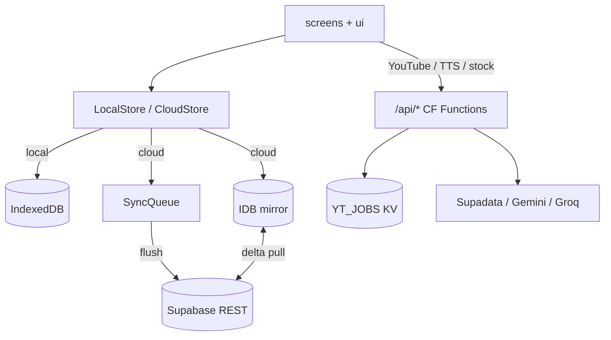

# Architecture — КАР-точки

How the self-hosted PWA is structured. For day-to-day coding conventions see [CLAUDE.md](../CLAUDE.md); for deploy see [docs/DEPLOY.md](./DEPLOY.md).

## Runtime modes

| Mode | Entry | Data |
|------|--------|------|
| **Dev** | `npm run dev` → root `index.html` → `js/app.js` (tsc emit, no bundler) | LocalStore (IndexedDB) or CloudStore |
| **Prod** | `npm run build:bundle` → `dist/` (esbuild + code-splitting + `dist/sw.js`) | Same stores; SW precaches bundle chunks |
| **API** | Cloudflare Pages Functions under `functions/api/` | KV `YT_JOBS`, BYOK keys from client settings |

## Layers

- `js/data/` — stores, schema version, SRS queries, sync-queue, cloud delta
- `js/lib/` — pure helpers (SRS, i18n, Anki parse, YouTube import helpers); **do not** import from `screens/`
- `js/ui/` — shell, navigation (`nav`), shared widgets
- `js/screens/` — route screens; lazy `import()` from the router

## Sync (cloud)

1. Optimistic writes go to the IDB mirror + SyncQueue.
2. `flushSync()` applies ops to Supabase; permanent failures → **dead letters** (Settings → Sync queue).
3. Pull uses `synced_at` (or `updated_at` fallback) watermarks — see `js/data/cloud-delta.ts`.

## Schema

`REQUIRED_SCHEMA_VERSION` in `js/data/schema-version.ts` must match applied Supabase migrations (`supabase/migrations/`). Mismatch shows a banner in the shell.

## Extension

`extension/` (MV3) talks to the same `/api/yt-*` endpoints and writes cards via Supabase with the connected session (`?ext_connect=1`). See [chrome-extension.md](./chrome-extension.md) and [extension-privacy.md](./extension-privacy.md).
