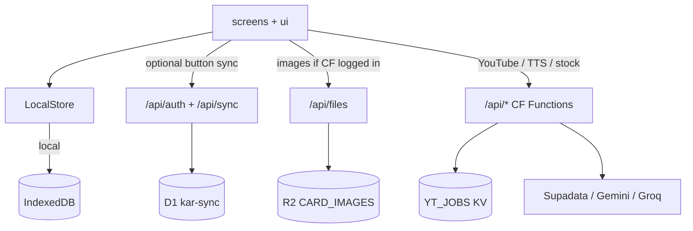

# Architecture — КАР-точки

How the self-hosted PWA is structured. Agent contract: [AGENTS.md](../AGENTS.md). Coding conventions: [CLAUDE.md](../CLAUDE.md); deploy: [DEPLOY.md](./DEPLOY.md); agent router: [AGENT.md](./AGENT.md).

## Runtime modes

| Mode | Entry | Data |
|------|--------|------|
| **Dev** | `npm run dev` → root `index.html` → `js/app.js` (tsc emit, no bundler) | **LocalStore** (IndexedDB) always |
| **Prod** | `npm run build:bundle` → `dist/` | Same; SW precaches bundle chunks |
| **API** | Cloudflare Pages Functions under `functions/api/` | KV `YT_JOBS`, D1 `SYNC_DB`, R2 `CARD_IMAGES`, BYOK keys from client |

```mermaid
flowchart TB
  UI[screens + ui] --> Store[LocalStore]
  Store -->|local| IDB[(IndexedDB)]
  UI -->|optional button sync| CfSync["/api/auth + /api/sync"]
  CfSync --> D1[(D1 kar-sync)]
  UI -->|images if CF logged in| Files["/api/files"]
  Files --> R2[(R2 CARD_IMAGES)]
  UI -->|YouTube / TTS / stock| API["/api/* CF Functions"]
  API --> KV[(YT_JOBS KV)]
  API --> Upstream[Supadata / Gemini / Groq]
```

## Layers

- `js/data/` — LocalStore, SRS queries, **cf-auth / cf-sync / cf-files**, sync-queue helpers
- `js/lib/` — pure helpers (SRS, i18n, Anki parse, YouTube import); **do not** import from `screens/`
- `js/ui/` — shell, navigation (`nav`), shared widgets
- `js/screens/` — route screens; lazy `import()` from the router

## Sync model

### Local-first (only product path)

- Boot always uses `LocalStore`; `kar_mode=cloud` is rewritten to `local`.
- Data lives in IndexedDB. Multi-device backup: Settings → **Cloudflare sync** (email/password JWT, full export JSON v3 snapshot to D1).
- Images: without CF login → data URL; with CF login → R2 via `js/data/cf-files.ts` (`r2:` refs + signed `GET /api/files`).

### Legacy Supabase

Removed from UX and default code path. Historical Postgres migrations: [legacy/README.md](./legacy/README.md). Migrate via JSON export/import.

## Schema

- Cloudflare D1 sync: `migrations/0001_cf_sync.sql` (`cf_users`, `cf_sync_snapshots`); binding `SYNC_DB`; secret `SYNC_JWT_SECRET`.
- R2: private bucket `kar-card-images`, binding `CARD_IMAGES`.

## Extension

`extension/` (MV3) generates YouTube cards and **downloads JSON** for import into the PWA (no Supabase write). See [chrome-extension.md](./chrome-extension.md).
